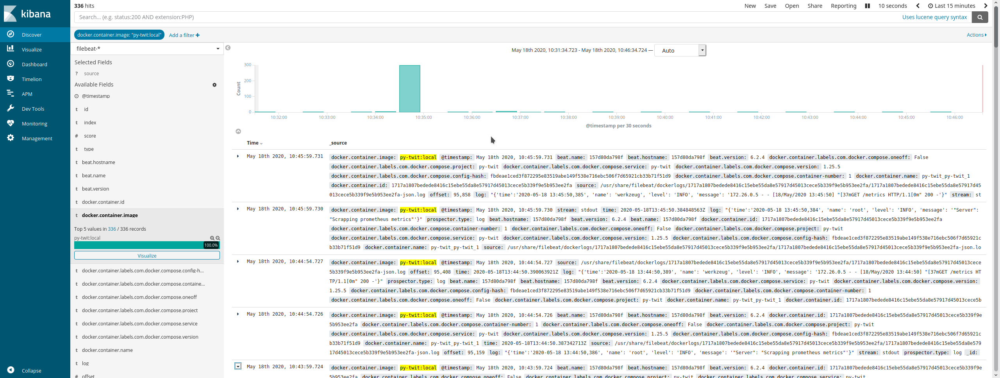
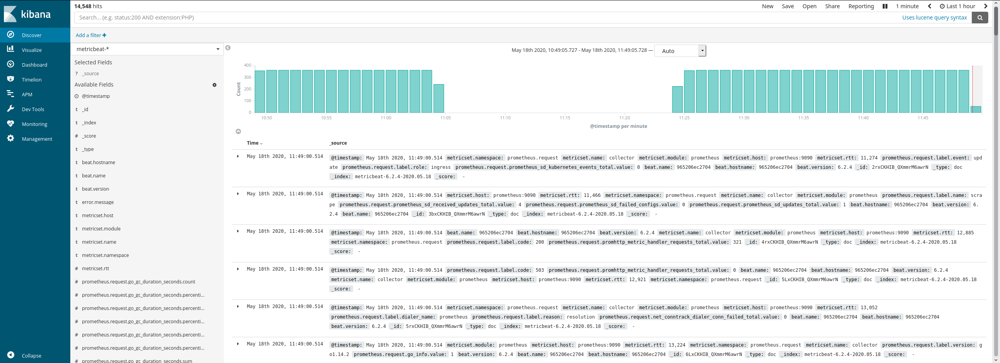

# SRE Case - py-twit
Colete as últimas postagens do Twitter, dado o seguinte conjunto de tags.
```text
#openbanking, #remediation, #devops, #sre, #microservices, #observability, #oauth, #metrics, #logmonitoring, #opentracing
```
Obtenha os dados sumarizados sobre usuários e postagens por hora e por local/idioma através da API fornecida.

## Deploy
Adicione como variáveis de ambiente suas credenciais da API do Twitter:
```bash
export API_KEY=<your API key>
export API_KEY_SECRET=<your API secret key>
export ACCESS_TOKEN_KEY=<your access token>
export ACCESS_TOKEN_SECRET=<your access token secret>
```

Depois, basta executar o docker-compose na raiz do repositório clonado do git,
[py-twit](https://github.com/carlhtorres/py-twit).
```bash
docker-compose up --build --detach
```

A API deve ficar disponível em `localhost:8000`, e o Kibana em `localhost:5601`.

## Aplicação
O Dockerfile, as dependências do pip e as configurações de logs encontram-se em `./application`.
O código fonte está aninhado em `./application/app`. Escrito em python3, para executá-lo isolado declare as variáveis
de ambiente necessárias e execute:
```bash
cd ./application/app
pip install --no-cache-dir -r ../requirements.txt
python3 py-twit.py
```
A API deve ficar disponível em [localhost:8000](http://localhost:8000). Métrica podem ser acessadas em
[localhost:8000/metrics](http://localhost:8000/metrics). Vale notar que os logs serão direcionados para o STDOUT.

### API
Os seguintes pontos de acesso estão disponíveis. Todos respondem com um JSON, salvo o endpoint do Prometheus.

`/api/search/all`
* Chama o processo que busca na API do Twitter e alimenta o banco de dados interno.

`/api/read/tweet/<tweet_id>`
* Retorna o tweet com o ID no fim da URL em questão.

`/api/read/hashtag/<hashtag>`
* Retorna todos os tweets que contenham a hashtag.

`/api/statistics/users`
* Retorna a lista com os 5 usuários com maior número de seguidores.

`/api/statistics/tweets`
* Retorna o agregado dos últimos tweets por hora.

`/metrics`
* Retorna as métricas do Prometheus

Para auxiliar no uso da API, encontra-se [aqui](./docs/py-twit.postman_collection.json) uma coleção do Postman
com as requests já configuradas.

## Logs
### WIP
Escrever as queries para filtrar os dados salvos no ES. Vide imagem de exemplo.


## Métricas
### WIP
Escrever as queries para filtrar os dados salvos no Prometheus e 
estender a cobertura do monitoramento dentro da aplicação.
As métricas já estão salvas no ES.


## Infraestrutura
A aplicação é encapsulado em um container que é construído junto com a execução do `docker-compose`.
A API e as métricas são expostas na 8000.

Os logs são escritos para o STDOUT e ficam disponíveis para o filebeat através do gerenciamento de logs do docker.
O filebeat persiste os logs de todos os containers no elasticsearch(ES).

As métricas são agregadas em um container contendo o servidor de Prometheus, que por sua vez fornece as métricas para
um container do metricbeat que as persiste no ES.

Para visualizar os dados salvos, podemos acessar o Kibana, que lê as informações salvas no ES.

Podemos ver abaixo uma ilustração da infraestrutura, com o fluxo de logs e métricas da aplicação anotados.


# Referências
- Como configurar filebeat para coletar todos os logs gerados pelo docker:
[Powerful logging with Docker, Filebeat and Elasticsearch
Bruno COSTE](https://medium.com/@bcoste/powerful-logging-with-docker-filebeat-and-elasticsearch-8ad021aecd87).
- Biblioteca para acessar a API do Twitter e buscar: [python-twitter](https://python-twitter.readthedocs.io/en/latest/).
- Documentação oficial do elasticsearch, kibana, filebeat e metricbeat, para as versões **6.2.4**.
- Documentação oficial do sqlite3 e do python 3.